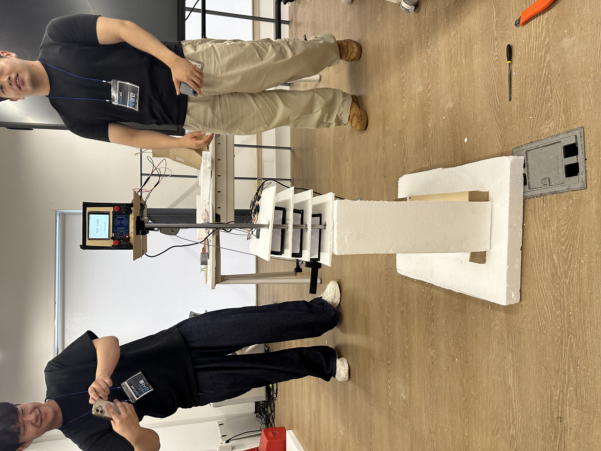
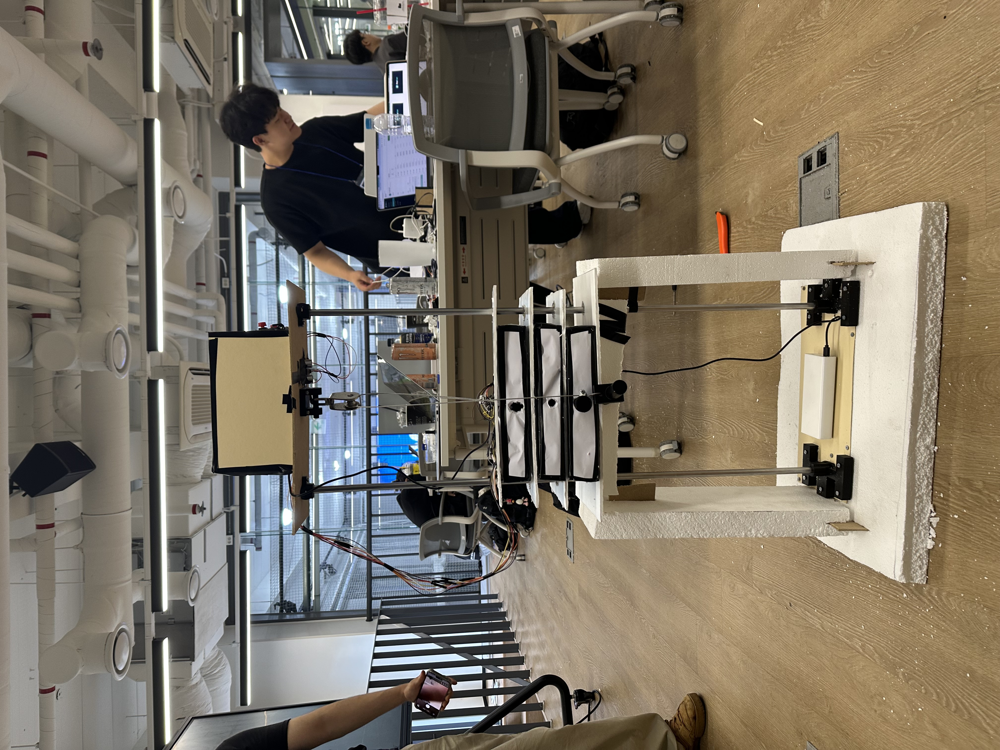
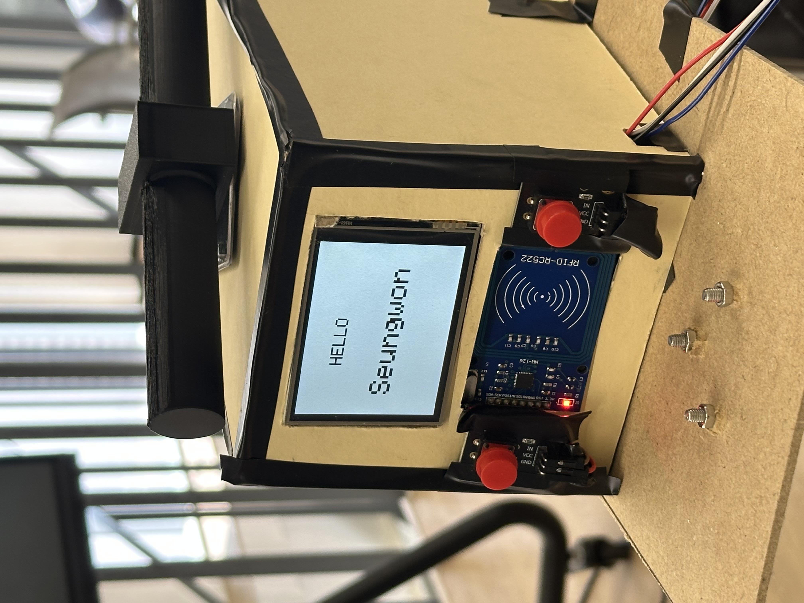

# RepCast

> **Rep + Broadcast — 헬스장 운동을 유의미한 데이터로**

[](https://youtube.com/shorts/O5WpgZyXY48)


## 프로젝트 개요

RepCast는 기존 헬스장 기구에 센서 모듈을 부착해 회원의 운동을 자동으로 기록하고, 수집된 데이터를 회원과 헬스장 운영자에게 전달하는 **레트로핏 스마트 피트니스 솔루션**입니다.

스마트 운동 환경을 만들기 위해 모든 기구를 고가의 최신 장비로 교체하는 대신, 이미 사용 중인 기구에 센서와 디스플레이를 추가합니다. 회원이 운동을 시작하기 전에 RFID 카드를 태그하면 시스템이 사용자를 식별하고, 기구의 움직임과 선택된 무게를 감지해 반복 횟수와 세트, 운동량을 자동으로 기록합니다.

운동 중에는 기구에 부착된 화면에서 현재 무게와 반복 횟수, 세트, 휴식 상태를 실시간으로 확인할 수 있습니다. 운동이 끝나면 기록은 서버에 저장되며, 운영자는 웹 대시보드에서 회원별 운동 기록과 기구 이용 현황을 확인할 수 있습니다. 회원에게는 누적 데이터를 분석한 개인화 PDF 리포트가 이메일로 전달됩니다.

RepCast는 단순한 운동 횟수 측정 장치가 아닙니다. 운동 기구에서 발생하는 데이터를 회원의 성장 경험과 헬스장의 운영 지표로 연결하는 것이 이 프로젝트의 핵심입니다.

## 기획 배경

### 운동 기록은 쉽게 사라집니다

헬스장에서 수행한 운동은 사용자가 직접 기억하거나 앱에 입력하지 않으면 기록으로 남지 않습니다. 매 세트마다 무게와 횟수를 입력하는 과정은 번거롭고, 운동에 집중할수록 기록을 놓치기 쉽습니다. 기록이 쌓이지 않으면 이전 운동과 비교하기 어렵고, 자신의 성장을 체감하거나 다음 목표를 설정하기도 어렵습니다.

### 운영자는 기구 안에서 일어나는 일을 알기 어렵습니다

헬스장 운영자는 출입 기록만으로는 회원이 실제로 어떤 운동을 했는지 확인할 수 없습니다. 어떤 기구가 자주 사용되는지, 특정 시간대에 어디가 혼잡한지, 꾸준히 운동하던 회원의 운동량이 줄고 있는지 등을 정확히 파악하기 어렵습니다. 그 결과 기구 배치, 운영 시간, 회원 관리와 재등록 전략을 경험과 추측에 의존하게 됩니다.

### 기존 스마트 기구는 도입 비용이 높습니다

운동 기록 기능을 갖춘 스마트 기구가 존재하지만, 헬스장의 모든 장비를 교체하려면 큰 비용이 필요합니다. RepCast는 기구 전체가 아닌 센서 모듈만 추가하는 방식으로 초기 도입 부담을 줄이고, 기존 헬스장 환경을 유지하면서 데이터 기반 운영으로 전환할 수 있도록 설계했습니다.

## 개발 목표

RepCast가 구현하고자 한 핵심 목표는 다음과 같습니다.

### 1. 별도 입력 없는 자동 운동 기록

- RFID 카드 태그만으로 회원을 식별하고 운동 세션 시작
- 기구의 움직임을 감지해 반복 횟수와 세트 자동 기록
- 선택된 웨이트 위치를 감지해 운동 무게 계산
- 반복 횟수와 무게를 조합해 전체 운동 볼륨 산출

### 2. 운동에 집중할 수 있는 실시간 피드백

- TFT 화면에 현재 무게, 세트, 반복 횟수 표시
- 세트 사이의 휴식 상태와 진행 상황 제공
- LED와 부저를 활용한 직관적인 상태 피드백
- 운동 종료 후 당일 운동 결과와 성취 정보 제공

### 3. 회원과 운영자를 연결하는 데이터 플랫폼

- 센서 데이터를 Wi-Fi를 통해 서버에 전송
- 회원별·기구별 운동 세션을 데이터베이스에 저장
- 운영 대시보드에서 운동 현황과 이용 패턴 시각화
- 개인화된 운동 분석 리포트를 PDF와 이메일로 제공

## 주요 기능

### RFID 기반 회원 식별

회원마다 발급된 RFID 카드에는 RepCast 회원 UID가 기록됩니다. 운동 전 카드를 리더기에 태그하면 ESP32가 UID를 읽고 서버에서 회원 정보를 확인합니다. 확인된 회원의 운동 세션이 생성되므로, 별도의 로그인이나 스마트폰 조작 없이도 기록을 개인 계정에 연결할 수 있습니다.

운영자는 웹의 회원 관리 메뉴에서 이름, 연락처, 이메일, 이용권 정보를 등록하고 RFID 카드에 UID를 기록할 수 있습니다. 카드 기록 후 다시 읽어 UID가 올바르게 저장되었는지 검증하는 과정도 포함됩니다.

### 반복 횟수 및 무게 자동 감지

기구에 부착된 거리 센서는 웨이트 스택의 이동을 지속적으로 측정합니다. 단순히 센서 값이 한 번 변한 것을 반복으로 처리하지 않고, 기구가 정해진 움직임 구간을 통과하고 다시 돌아오는 과정을 하나의 반복으로 판정합니다. 이를 통해 짧은 흔들림이나 운동 중 발생하는 센서 노이즈가 횟수로 잘못 기록되는 것을 줄입니다.

Hall 센서는 웨이트 스택의 선택 핀 위치를 감지합니다. 감지된 위치를 실제 중량으로 변환해 현재 운동 무게를 결정하고, 반복 횟수와 결합해 운동 볼륨을 계산합니다.

### 실시간 운동 화면

기구에 장착된 TFT 화면은 회원이 스마트폰을 확인하지 않고도 운동 상태를 볼 수 있도록 구성했습니다. 화면에는 현재 무게, 진행 중인 세트, 반복 횟수와 휴식 상태가 표시됩니다. RFID 인식, 서버 연결, 세션 시작 및 종료와 같은 시스템 상태도 화면과 LED, 부저를 통해 전달됩니다.

### 운영 대시보드

React 기반 대시보드는 헬스장에서 발생하는 운동 데이터를 한눈에 확인할 수 있도록 제공합니다.

- 당일 총 세션 수
- 전체 운동 시간
- 총 세트 및 반복 횟수
- 전체 운동 볼륨
- 회원별 최근 운동 기록
- 회원별 운동량 순위
- 기구별 사용 횟수 및 운동량
- 시간대별 이용 현황
- 회원 등록 및 RFID 카드 관리
- 기구 상태와 최근 이용 시각 확인

대시보드는 단순히 저장된 데이터를 나열하는 것이 아니라, 운영자가 현재 헬스장의 이용 상황과 회원 활동을 빠르게 이해할 수 있도록 요약하는 역할을 합니다.

### 개인 운동 분석 리포트

RepCast는 회원 UID를 기준으로 누적된 운동 데이터를 분석해 개인화된 PDF 리포트를 생성합니다.

- 당일 운동 시간, 세트, 종목과 총 운동 볼륨
- 개인 최고 기록과 연속 운동 기록
- 월간 방문 및 운동량 목표 달성률
- 전체 회원 중 운동량 순위
- 최근 4주 운동 부위 비중과 볼륨 변화
- 부위별 회복 상태
- 부족한 운동 부위와 다음 운동 목표

생성된 리포트는 API를 통해 바로 내려받을 수 있으며, 등록된 회원 이메일로 개별 발송할 수도 있습니다. 운영 대시보드의 **기록지 보내기** 기능을 사용하면 모든 회원의 리포트를 각각 생성해 Gmail로 일괄 발송합니다.

## 서비스 이용 흐름

1. 운영자가 기존 운동 기구에 RepCast 센서 모듈을 설치합니다.
2. 회원이 운동을 시작하기 전에 자신의 RFID 카드를 태그합니다.
3. 서버가 회원을 확인하고 새로운 운동 세션을 생성합니다.
4. 거리 센서가 기구의 왕복 동작을 감지해 반복 횟수를 계산합니다.
5. Hall 센서가 선택된 웨이트 위치를 감지해 운동 무게를 결정합니다.
6. TFT 화면에 무게, 세트, 횟수와 휴식 상태가 실시간으로 표시됩니다.
7. 운동 종료 시 누적 횟수, 세트, 무게와 종료 시각이 서버에 저장됩니다.
8. 운영자는 대시보드에서 회원과 기구의 운동 기록을 확인합니다.
9. 회원은 이메일로 전달된 개인 리포트를 통해 운동 성과와 다음 목표를 확인합니다.

## 시스템 아키텍처

```text
┌──────────────── 운동 기구 ────────────────┐
│                                           │
│  [RFID 카드] ──→ [RC522 회원 식별]        │
│                                           │
│  [거리 센서] ──→ [반복 횟수 감지]         │
│  [Hall 센서] ──→ [선택 무게 감지]          │
│                         │                 │
│                         ▼                 │
│                    [ESP32] ──→ [TFT 화면] │
└─────────────────────────┬─────────────────┘
                          │ Wi-Fi / JSON
                          ▼
                  [FastAPI 백엔드]
                          │
                          ▼
                    [PostgreSQL]
                    ↙             ↘
          [React 운영 대시보드]   [PDF 리포트]
                                      │
                                      ▼
                                [Gmail 이메일]
```

센서 모듈은 현장에서 운동 데이터를 생성하고, 백엔드는 회원·기구·세션을 연결해 데이터를 저장합니다. 대시보드는 운영자에게 전체 현황을 제공하며, PDF 리포트는 같은 데이터를 회원이 이해하기 쉬운 형태로 다시 전달합니다.

## 기술 스택

| 구분 | 기술 | 역할 |
| --- | --- | --- |
| 메인 컨트롤러 | ESP32, Arduino C++ | 센서 제어, 운동 상태 처리, Wi-Fi 통신 |
| 회원 식별 | RC522, MIFARE RFID | 회원 카드 읽기 및 UID 매핑 |
| 운동 감지 | HC-SR04, Hall Sensor | 반복 동작과 선택 무게 감지 |
| 화면 및 피드백 | ILI9341 TFT, LED, Buzzer | 운동 정보와 장치 상태 표시 |
| 백엔드 | Python, FastAPI, Uvicorn | 회원·기구·세션·리포트 API 제공 |
| 데이터베이스 | PostgreSQL | 운동 기록과 서비스 데이터 저장 |
| 프론트엔드 | React, Lucide React | 운영 대시보드 및 회원 관리 UI |
| PDF 리포트 | ReportLab | 개인 운동 데이터 시각화 |
| 이메일 | Gmail SMTP | 개인 및 전체 회원 리포트 발송 |

## API 구성

| 엔드포인트 | Method | 기능 |
| --- | --- | --- |
| `/user/register` | `POST` | 신규 회원을 등록하고 카드에 기록할 UID 생성 |
| `/user` | `GET` | 전체 회원 또는 UID에 해당하는 회원 조회 |
| `/equipment` | `GET` | 등록된 운동 기구와 현재 상태 조회 |
| `/session` | `GET` | 회원·기구 정보가 포함된 전체 운동 세션 조회 |
| `/session/start` | `POST` | RFID 인증 후 운동 세션 생성 |
| `/session/finish` | `POST` | 횟수, 세트, 무게와 종료 시각 저장 |
| `/report` | `GET` | UID에 해당하는 개인 운동 분석 PDF 생성 |
| `/report/email` | `POST` | 특정 회원에게 개인 리포트 이메일 발송 |
| `/report/email/all` | `POST` | 모든 회원에게 각자의 리포트 일괄 발송 |

## 데이터베이스 구성

### 회원 정보

| 컬럼 | 설명 |
| --- | --- |
| `uid` | RFID 카드와 회원을 연결하는 고유 식별자 |
| `name` | 회원 이름 |
| `tel` | 회원 연락처 |
| `email` | 개인 리포트를 받을 이메일 주소 |
| `join_date` | 회원 가입일 |
| `expire_date` | 이용권 만료일 |
| `last_use` | 마지막 이용 시각 |

### 운동 기구 정보

| 컬럼 | 설명 |
| --- | --- |
| `id` | 기구 고유 식별자 |
| `name` | 기구 이름 |
| `category` | 가슴, 등, 어깨, 하체 등 운동 부위 |
| `gym` | 기구가 설치된 지점 |
| `status` | 사용 가능 여부와 현재 상태 |
| `last_used` | 마지막 이용 시각 |

### 운동 세션

| 컬럼 | 설명 |
| --- | --- |
| `sid` | 운동 세션 고유 식별자 |
| `uid` | 운동을 수행한 회원 |
| `gym` | 운동이 이루어진 헬스장 |
| `equipment` | 사용한 운동 기구 |
| `count` | 전체 반복 횟수 |
| `set` | 전체 세트 수 |
| `weight` | 운동 무게 |
| `start` | 운동 시작 시각 |
| `finish` | 운동 종료 시각 |

운동 세션은 회원, 헬스장, 기구 정보를 연결하는 핵심 데이터입니다. 같은 세션 데이터를 운영 대시보드의 집계와 개인 리포트 분석에 함께 사용해, 측정부터 활용까지 하나의 흐름을 유지합니다.

## 하드웨어 동작 원리

1. ESP32가 Wi-Fi에 연결되고 RFID 리더와 각 센서, TFT 화면을 초기화합니다.
2. 회원이 RFID 카드를 태그하면 카드에 기록된 UID를 읽습니다.
3. UID를 서버에 전달해 회원 정보를 확인하고 세션 ID를 발급받습니다.
4. 거리 센서가 웨이트 스택과의 거리를 반복 측정합니다.
5. 측정값이 설정된 동작 구간을 왕복하면 정상적인 반복 1회로 판정합니다.
6. Hall 센서의 감지 위치를 기준으로 선택된 무게를 계산합니다.
7. ESP32가 횟수, 세트와 무게를 TFT 화면에 즉시 반영합니다.
8. 운동 종료 신호가 입력되면 최종 운동 데이터를 세션 ID와 함께 서버로 전송합니다.
9. 서버는 세션을 완료 상태로 갱신하고 대시보드와 리포트에 반영합니다.

## 실제 모습

|  |   |  |
| :---: | :---: | :---: |
| 정면 | 측면 | 모듈 |


## 기대 효과

### 회원에게

- 별도의 앱 조작 없이 자동으로 운동 기록 축적
- 개인 최고 기록과 장기적인 운동 변화 확인
- 구체적인 수치와 목표를 통한 성취감 및 운동 동기 강화
- 부족한 운동 부위와 회복 상태를 고려한 다음 운동 계획 수립

### 헬스장 운영자에게

- 회원의 실제 운동량과 이용 패턴 파악
- 활동량 감소를 바탕으로 회원 이탈 징후 확인
- 인기 기구와 시간대별 혼잡도 분석
- 기구 배치, 유지 관리와 운영 일정 개선
- 개인화된 기록지를 활용한 회원 관리와 재등록 유도

회원이 자신의 성장을 확인해 운동을 지속하면 헬스장의 방문과 재등록으로 이어집니다. RepCast는 회원을 위한 운동 기록과 운영자를 위한 비즈니스 데이터를 동시에 만들어 두 사용자의 가치를 하나의 선순환 구조로 연결합니다.

## 확장 방향

- 다양한 운동 기구에 적용 가능한 범용 센서 및 부착 구조
- 기구별 가동 범위 자동 보정과 반복 판정 정확도 향상
- 프리웨이트 운동의 수동·자동 기록 지원
- 시간대별 혼잡도와 기구 실사용률 분석
- 운동량 감소 기반 회원 이탈 가능성 탐지
- 개인 운동 이력과 회복 상태를 반영한 맞춤형 운동 추천
- 여러 지점을 통합 관리하는 헬스장 운영 플랫폼

## 프로젝트가 지향하는 것

RepCast의 목표는 새로운 운동 기구를 만드는 것이 아닙니다. 이미 존재하는 운동 기구에 센서와 데이터 흐름을 더해, 평범한 헬스장을 회원의 성장을 기록하고 운영자의 의사결정을 돕는 스마트 피트니스 공간으로 바꾸는 것입니다.

기구를 교체하지 않고도 운동을 기록할 수 있고, 한 번 측정된 데이터가 회원의 동기부여와 헬스장의 운영 개선에 함께 사용되는 것. 이것이 RepCast가 제안하는 데이터 기반 헬스장의 모습입니다.

## 역할
| 소속 | 이름 | 역할 |
| --- | --- | --- |
| 건국대학교 산업공학과 | 박형민 | PM |
| 건국대학교 컴퓨터공학부 | 이승원 | 대시보드 개발(프론트엔드 & 백엔드) |
| 건국대학교 공과대학자유전공학부 | 김시율 | 하드웨어 개발(회로 설계 & 코드 개발) |
| 건국대학교 전기전자공학부 | 백효찬 | 하드웨어 기구 설계 |
| 건국대학교 산업공학과 | 이자영 | 하드웨어 제작 |
